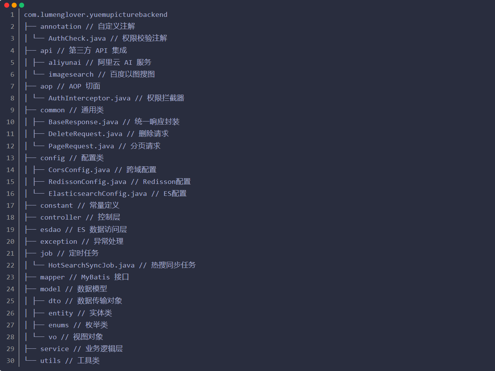

# 悦木图片管理系统后端

## 项目介绍
悦木图片管理系统是一个基于 Spring Boot + Vue3 的全功能图片社交管理平台。支持图片上传与管理、RAG 智能客服、AI 图像处理、社区论坛、实时聊天、微信扫码登录等丰富功能。本仓库为后端部分，采用前后端分离架构，提供 RESTful API 接口。
http://localhost:8123/api/doc.html#/home
## 技术栈

### 核心框架
- Spring Boot 2.7.x - 应用基础框架
- Spring MVC - Web 框架
- MyBatis Plus 3.5.x - ORM 框架
- MySQL 8.0 - 关系型数据库
- Redis 6.x - 缓存数据库、计数器、限流
- Elasticsearch 7.17.x - 搜索引擎、长期记忆检索
- WebSocket - 实时通信（聊天、通知）
- Sa-Token - 认证鉴权框架

### 存储
- 腾讯云 COS 对象存储 - 图片/文件存储
- MySQL - 业务数据持久化
- Redis - 缓存、会话上下文、消息计数、分布式锁
- Elasticsearch - 全文检索、图片搜索、RAG 超长记忆

### 中间件与工具
- Redisson - 分布式锁、限流
- Spring Task - 定时任务调度（推荐分数、热搜同步等）
- Spring AOP - 权限校验、日志记录、接口限流
- WebClient - 异步 HTTP 调用（对接 Python 服务）

### AI 能力
- **RAG 智能客服** - 基于知识库的检索增强生成问答系统
- **YOLO 目标检测** - 图片物体识别
- **AI 图像处理** - 去背景、人脸模糊、换背景
- 阿里云 AI 扩图服务 - 图片智能扩展
- 百度以图搜图 API - 相似图片搜索
- DeepSeek AI - 智能对话助手
- 通义千问 - RAG 文本生成与摘要

### Python 子服务
系统内置独立的 Python RAG 服务（FastAPI），提供：
- `/api/rag/sync` - 同步问答接口
- `/api/rag/stream` - 流式问答接口（SSE）
- `/api/rag/summarize` - 专用摘要生成接口
- `/api/knowledge/*` - 知识库文件管理
- `/api/yolo/*` - YOLO 目标检测
- `/api/ai/*` - AI 图像处理（去背景、人脸模糊、换背景）

## 系统架构

### 整体架构


### 分层架构



## 核心功能详解

### 1. 用户模块
- **注册登录**：支持账号密码注册、**微信扫码登录/注册**
- **微信登录**：基于微信公众平台，扫描二维码快速登录，支持自动创建新用户
- **用户管理**：个人信息修改、头像上传、签到系统
- **权限控制**：基于 Sa-Token 的 RBAC 权限管理（管理员/普通用户）
- **关注系统**：用户互相关注、粉丝列表

### 2. 图片管理
- **图片上传**：支持单图/多图上传，腾讯云 COS 存储，自动提取元信息
- **图片处理**：AI 扩图（阿里云）、AI 去背景、人脸模糊、换背景
- **图片组织**：分类管理、标签系统、时光相册
- **图片安全**：敏感内容检测、访问权限控制
- **YOLO 检测**：支持上传图片或 URL 进行目标检测与物体识别
- **推荐系统**：基于浏览、点赞、评论、分享的多维度推荐分数计算，支持时间衰减和增量更新

### 3. 空间管理
- **空间类型**：个人空间、团队空间
- **成员管理**：角色分配、权限控制、成员邀请
- **空间分析**：容量统计、使用分析、数据看板
- **容量控制**：空间配额、容量预警

### 4. RAG 智能客服系统
- **知识库管理**：支持上传 TXT/PDF 等文档，自动向量化入库，最多支持 25 个文件
- **智能问答**：基于检索增强生成（RAG），结合知识库内容精准回答用户问题
- **流式回答**：SSE 流式输出，实现打字机效果的实时回答
- **会话管理**：多会话支持、会话历史记录、会话重命名/删除
- **超长记忆（LTM）**：
  - **Redis 计数触发**：使用 Redis INCR 原子计数，每 10 条消息自动总结
  - **多级摘要架构**：Level 0（每 10 条消息 → 1 条局部摘要）、Level 1（每 10 条摘要 → 1 条全局摘要）
  - **ES 检索融合**：用户提问时自动从 ES 检索相关历史摘要，注入 Prompt 增强上下文
  - **专用摘要接口**：独立的 `/api/rag/summarize` 端口，绕过 RAG 知识库约束，确保摘要生成稳定

### 5. 社区论坛
- **帖子系统**：发帖、编辑、删除、帖子分类与标签
- **互动功能**：点赞、收藏、评论（支持多级回复）、分享
- **推荐排序**：热门帖子推荐、标签推荐

### 6. 搜索系统
- **全文检索**：基于 Elasticsearch 的图片/帖子全文搜索
- **以图搜图**：基于百度 API 的相似图片搜索
- **热门搜索**：自动统计热搜关键词，定时同步更新
- **搜索建议**：多级缓存加速、搜索联想

### 7. 实时聊天系统
- **图片聊天室**：图片详情页的实时讨论区（WebSocket）
- **私聊系统**：用户间一对一私信聊天
- **消息中心**：系统通知、互动消息（点赞/评论/关注提醒）统一管理
- **AI 聊天**：DeepSeek 智能对话助手，支持多轮对话

### 8. 社交功能
- **表白墙**：匿名/实名表白、音乐相册关联
- **留言板**：支持匿名留言
- **微语（说说）**：类似朋友圈的动态发布
- **友情链接**：站点互链管理

### 9. 活动系统
- **活动管理**：创建/编辑/删除活动
- **活动报名**：用户报名参与、名额控制
- **活动状态**：未开始/进行中/已结束自动流转

### 10. 休闲娱乐
- **贪吃蛇**：三种模式（经典/无墙/竞速），排行榜系统
- **2048 游戏**：经典 2048 小游戏，支持记录保存

### 11. 运维与管理
- **数据看板**：管理员仪表盘，用户/图片/帖子等核心数据统计
- **举报系统**：用户举报、管理员审核处理
- **Bug 反馈**：用户提交 Bug 报告，管理员处理追踪
- **Redis 缓存监控**：缓存命中率、内存使用状况实时监控
- **系统通知**：管理员向全体/指定用户发送系统通知
- **提醒功能**：自定义提醒事项管理

### 12. 微信登录开启指南
本系统支持微信扫描二维码快速登录/注册。开启步骤如下：

#### 1. 内网穿透配置（开发环境）
由于微信服务器需要访问你的本地服务，建议使用 NATAPP 等工具进行内网穿透：
- **协议**：Web
- **本地端口**：`8123`（需与 `application-dev.yml` 中的 `server.port` 一致）
- **复制域名**：例如 `https://yuemutuku.natapp1.cc`

#### 2. 微信公众平台配置
登录 [微信公众平台](https://mp.weixin.qq.com)，进入"设置与开发" -> "接收消息设置"：
- **URL**：`你的域名/api/check`（例如 `https://yuemutuku.natapp1.cc/api/check`）
- **Token**：自定义（需与代码中配置一致，如 `yuemutuku`）
- **EncodingAESKey**：随机生成
- **消息加解密模式**：明文模式
- **数据格式**：XML

#### 3. 后端配置文件修改
在 `src/main/resources/application-dev.yml` 中填入你的密钥：
```yaml
wx:
  mp:
    appId: 你的AppID
    appSecret: 你的AppSecret
    token: 你在微信后台设置的Token
```

#### 4. 验证连接
点击微信后台的"提交"按钮。若提示"提交成功"，则表示后端接口校验通过。

## 核心特性

### 1. 高可用设计
- 服务无状态，支持水平扩展
- 分布式锁保证并发安全
- Sa-Token 支持分布式会话

### 2. 高性能
- 多级缓存架构（本地缓存 + Redis + ES）
- Redis 原子计数（RAG 消息计数，避免频繁 DB 查询）
- 异步处理（摘要生成、消息通知、图片处理均异步化）
- 增量更新推荐分数，避免全量计算

### 3. 安全性
- Sa-Token 认证鉴权
- 接口限流（AOP + Redis，支持匿名/登录用户差异化限流）
- 敏感数据加密、SQL 注入防护
- 操作日志记录

### 4. 可扩展性
- 模块化设计，各功能模块独立
- Python 子服务独立部署，通过 HTTP 对接
- 配置外部化（`application.yml` 多环境配置）

## 部署说明

### 环境要求
- JDK 1.8+
- MySQL 8.0+
- Redis 6.x+
- Elasticsearch 7.17.x
- Maven 3.6+
- Python 3.8+（RAG 子服务）
- Nginx 1.18+（生产环境）

### RAG 子服务部署
```bash
cd python-rag/src
pip install -r requirements.txt
python main.py  # 默认端口 8001
```

## 更新日志

### v2.0.0 (2026-03)

#### 🔐 认证与安全
- **Sa-Token 全面迁移**：从原有的 Session 认证体系升级为 Sa-Token 框架，支持 token 无状态认证、多端登录控制、分布式会话管理
- **微信扫码登录**：集成微信公众平台，支持扫描二维码快速登录/自动注册新用户，基于 NATAPP 内网穿透实现开发环境调试
- **接口限流增强**：基于 AOP + Redis 实现精细化限流，支持匿名/登录用户差异化限流策略

#### 🤖 AI 与智能
- **RAG 智能客服系统**：
  - 知识库管理（上传/删除/清空知识库文件，最多 25 个）
  - 检索增强生成问答（基于向量检索 + 通义千问大模型）
  - SSE 流式回答（打字机效果实时输出）
  - 多会话管理（创建/重命名/删除/历史记录）
- **超长记忆（LTM）架构**：
  - Redis INCR 原子计数触发，每 10 条消息自动总结
  - 多级摘要：Level 0（局部摘要）+ Level 1（全局摘要，覆盖 100+ 轮对话）
  - ES 语义检索融合，自动注入相关历史摘要到 Prompt
  - 专用 `/api/rag/summarize` 接口，独立于 RAG 知识库约束
- **YOLO 目标检测**：集成 YOLOv8 模型（ONNX Runtime），支持上传图片或 URL 进行物体识别
- **AI 图像处理**：
  - 智能去背景（rembg 引擎，返回透明 PNG）
  - 人脸自动打马赛克（OpenCV 人脸检测 + 高斯模糊）
  - 智能换背景（MODNet，支持纯色或自定义图片背景）
- **DeepSeek AI 对话**：集成 DeepSeek 大模型，支持多轮对话、代码生成、知识问答

#### 🌐 社交与社区
- **社区论坛**：帖子发布/编辑/删除、分类标签、多级评论回复
- **表白墙**：匿名/实名表白、音乐相册关联
- **私聊系统**：用户间一对一私信聊天
- **活动系统**：活动创建/报名/名额控制/状态流转
- **留言板**：匿名留言功能
- **微语（说说）**：类似朋友圈的动态发布与互动

#### 🛠️ 运维与工具
- **数据看板**：管理员仪表盘，用户/图片/帖子等核心数据统计与可视化
- **举报系统**：用户举报 + 管理员审核处理
- **Bug 反馈**：用户提交 Bug 报告，管理员追踪处理
- **Redis 缓存监控**：缓存命中率、内存使用状况实时监控
- **系统通知**：管理员向全体/指定用户推送通知
- **提醒功能**：自定义提醒事项管理
- **推荐算法优化**：增量更新 + 时间衰减 + 多维权重（浏览/点赞/评论/分享）

### v1.2.0 (2025-03)
- 新增贪吃蛇小游戏功能（经典/无墙/竞速三种模式）
- 新增游戏排行榜系统（分模式独立排行）
- 新增 2048 小游戏
- 新增记事本功能（富文本编辑、云端同步）
- 新增友情链接管理
- 优化图片上传流程与 COS 存储策略
- 修复已知问题

### v1.0.0 (2025-01)
- 项目初始化，基础图片管理功能
- 用户注册/登录、图片上传/管理
- 空间（个人/团队）管理
- Elasticsearch 全文搜索、以图搜图
- 点赞、收藏、评论、分享等社交互动
- WebSocket 实时聊天
- 阿里云 AI 扩图

## 联系方式
- 作者：鹿梦
- 邮箱：109484028@qq.com
